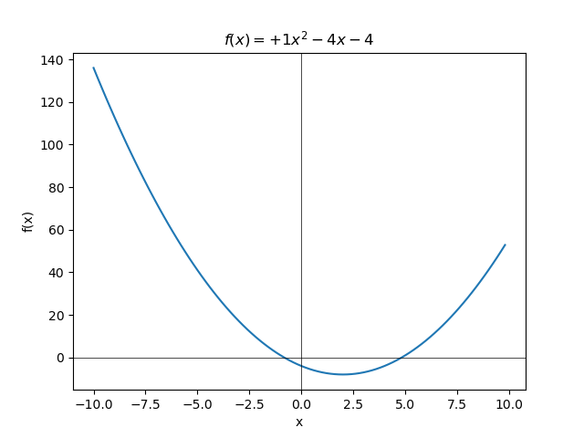
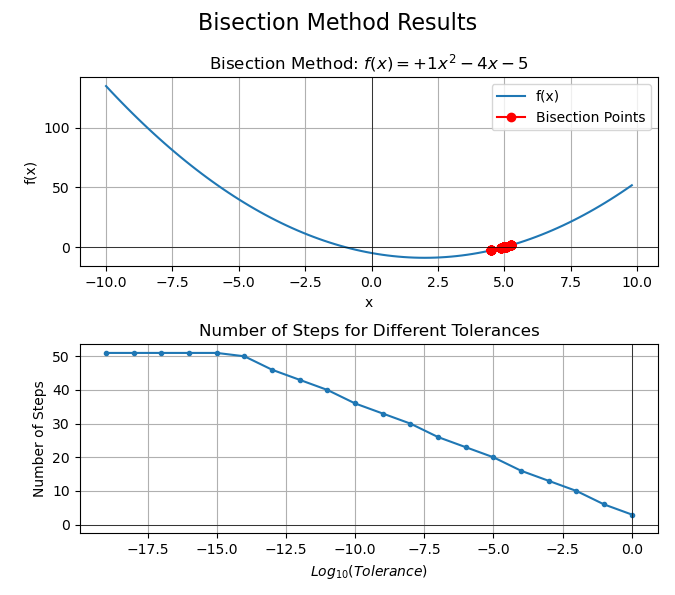
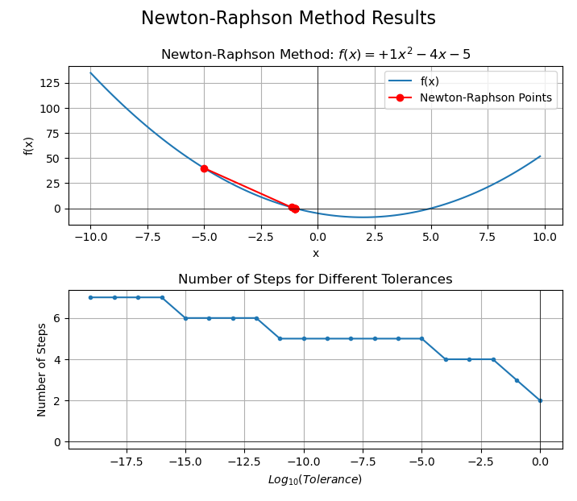

# Find roots of function using Bisection and Newton Raphson methods

## Function:

## Roots using Bisection Method

## Roots using Newton-Raphson Method

## Other Info
These numerical methods can be used to determine minima/roots of other functions as well. 

